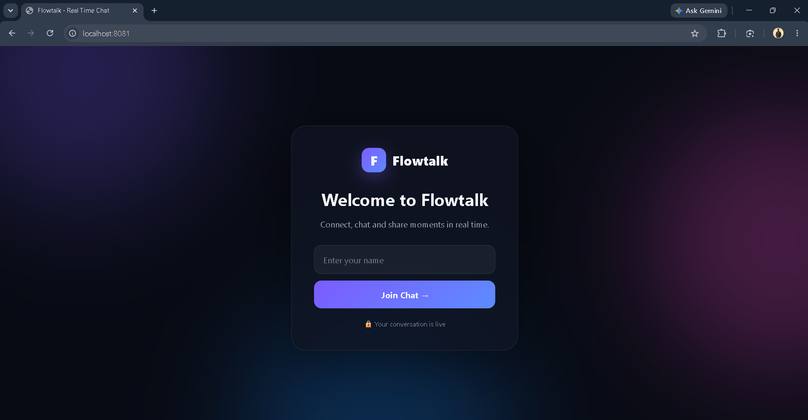
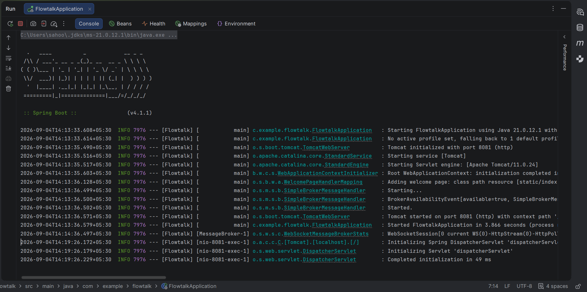
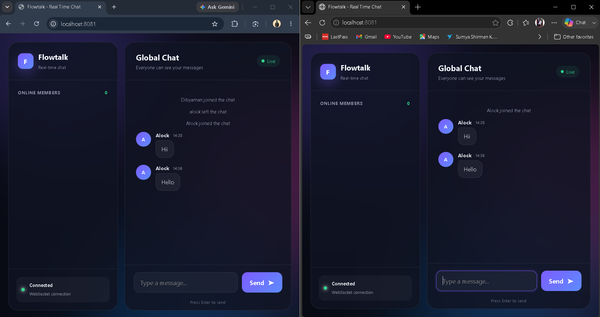

# Flowtalk — Real-Time Chat Application

> A modern real-time web chat application built with Spring Boot, WebSockets, STOMP, HTML, CSS, and JavaScript.

Flowtalk is a browser-based real-time chat application that allows multiple users to connect and exchange messages instantly.

The project demonstrates real-time communication using **Spring Boot WebSockets and STOMP**, combined with a responsive frontend built using **HTML, CSS, and JavaScript**.

---

## 🚀 Live Demo

### 🌐 Live Application

👉 **[Open Flowtalk Live](https://flowtalk-4ovp.onrender.com/)**

The application is deployed using **Docker and Render**.

### 💻 GitHub Repository

👉 **[View Source Code](https://github.com/dibyaman-sahoo/FlowTalk)**

---

## 📌 Project Overview

Flowtalk demonstrates how a real-time communication application can be built using:

- Java
- Spring Boot
- WebSockets
- STOMP
- HTML
- CSS
- JavaScript

The backend manages WebSocket connections and STOMP message routing, while the browser frontend receives real-time events and updates the interface without requiring page refreshes.

---

## ✨ Key Features

- 💬 Real-time global messaging
- 👥 Multiple users connected simultaneously
- 🟢 WebSocket connection status
- 👤 Online member tracking
- ⌨️ Typing indicators
- 🔔 Join notifications
- 🚪 Leave notifications
- 🕒 Message timestamps
- 🔄 Automatic WebSocket reconnection
- 📱 Responsive user interface
- 🎨 Modern glassmorphism-inspired design
- ✨ Animated background elements
- 🌐 Browser-based application

---

## 🛠️ Technologies Used

### Backend

- **Java 21**
- **Spring Boot 4.1.1**
- Spring Web MVC
- Spring WebSocket
- STOMP Messaging
- Maven
- Embedded Tomcat

### Frontend

- HTML5
- CSS3
- JavaScript
- STOMP.js
- Responsive CSS
- CSS animations

### Deployment

- Docker
- Render

### Development

- IntelliJ IDEA
- JDK 21
- Maven
- Google Chrome / Microsoft Edge

---

## 🏗️ Application Architecture

```text
                    ┌─────────────────────────┐
                    │        Browser 1         │
                    │    HTML/CSS/JavaScript   │
                    └────────────┬────────────┘
                                 │
                          WebSocket / STOMP
                                 │
                                 ▼
                    ┌─────────────────────────┐
                    │      Spring Boot        │
                    │    WebSocket Server     │
                    └────────────┬────────────┘
                                 │
                         STOMP Message Broker
                                 │
                  ┌──────────────┴──────────────┐
                  │                             │
                  ▼                             ▼
          /topic/messages                 /topic/users
                  │                             │
                  ▼                             ▼
          Chat Subscribers                Online Users
                  │
                  ▼
          ┌─────────────────────────┐
          │        Browser 2        │
          │    HTML/CSS/JavaScript  │
          └─────────────────────────┘
````

---

## 🔄 How Flowtalk Works

1. A user opens the Flowtalk application.
2. The user enters a username.
3. The JavaScript client creates a WebSocket/STOMP connection.
4. The client connects to the `/ws` WebSocket endpoint.
5. The client subscribes to the required STOMP topics.
6. A user sends a chat message.
7. The message is sent to the Spring Boot backend.
8. `ChatController` processes the message.
9. The server broadcasts the message through the STOMP broker.
10. Connected users receive the message instantly.
11. User connection events update the online-user list.
12. Typing events are broadcast in real time.

---

## 📡 WebSocket & STOMP Destinations

Flowtalk uses STOMP destinations to handle communication between the browser and Spring Boot backend.

### Client → Server

| Destination        | Purpose                         |
| ------------------ | ------------------------------- |
| `/app/chat.send`   | Sends a chat message            |
| `/app/chat.join`   | Announces that a user joined    |
| `/app/chat.leave`  | Announces that a user left      |
| `/app/chat.typing` | Sends typing-status information |

### Server → Clients

| Destination       | Purpose                                 |
| ----------------- | --------------------------------------- |
| `/topic/messages` | Broadcasts chat and join/leave messages |
| `/topic/users`    | Broadcasts the current online-user list |
| `/topic/typing`   | Broadcasts typing information           |

### WebSocket Endpoint

```text
/ws
```

The application uses:

```text
Application Prefix: /app
Broker Prefix:      /topic
WebSocket Endpoint: /ws
```

---

## 📁 Project Structure

```text
FlowTalk/
│
├── .mvn/
│   └── wrapper/
│
├── screenshots/
│   ├── <welcome-screen-screenshot>
│   ├── <spring-boot-console-screenshot>
│   ├── <two-user-chat-screenshot>
│   └── <working-process-gif>
│
├── src/
│   └── main/
│       ├── java/
│       │   └── com/
│       │       └── example/
│       │           └── flowtalk/
│       │               │
│       │               ├── FlowtalkApplication.java
│       │               │
│       │               ├── config/
│       │               │   └── WebSocketConfig.java
│       │               │
│       │               ├── controller/
│       │               │   └── ChatController.java
│       │               │
│       │               ├── listener/
│       │               │   └── WebSocketEventListener.java
│       │               │
│       │               └── model/
│       │                   ├── ChatMessage.java
│       │                   └── UserStatus.java
│       │
│       └── resources/
│           ├── application.properties
│           │
│           └── static/
│               ├── index.html
│               ├── style.css
│               └── app.js
│
├── Dockerfile
├── pom.xml
├── mvnw
├── mvnw.cmd
├── .gitignore
└── README.md
```

---

## 🧩 Important Components

### `FlowtalkApplication.java`

Main Spring Boot application entry point.

### `WebSocketConfig.java`

Configures:

* STOMP messaging
* WebSocket endpoint
* Application destination prefix
* Message broker

### `ChatController.java`

Handles:

* Chat messages
* Join events
* Leave events
* Typing events

using STOMP message mappings.

### `WebSocketEventListener.java`

Tracks WebSocket connection events and maintains the online-user information.

### `ChatMessage.java`

Represents chat message information such as:

* Sender
* Content
* Message type
* Timestamp

### `UserStatus.java`

Represents the currently connected users.

### `index.html`

Contains the Flowtalk welcome screen and chat interface.

### `style.css`

Controls:

* Responsive layout
* Glassmorphism styling
* Gradients
* Animations
* Message bubbles
* User interface elements

### `app.js`

Handles:

* STOMP client creation
* WebSocket connection
* Subscriptions
* Sending messages
* Receiving messages
* Typing indicators
* Online-user updates
* Reconnection

---

# 🖼️ Screenshots

All project screenshots and the working-process GIF are available inside the:

```text
screenshots/
```

folder.

## 1. Flowtalk Welcome Screen

The welcome screen allows users to enter their username and join the chat.



---

## 2. Spring Boot Console

The IntelliJ IDEA console showing the Spring Boot application running successfully.



---

## 3. Two-User Real-Time Chat

Two browser users connected to the same Flowtalk server and exchanging messages in real time.


---

# 🎬 Working Process

The working-process GIF demonstrates the complete real-time communication flow:


```text
User 1
   ↓
Connects to Flowtalk
   ↓
WebSocket / STOMP
   ↓
Spring Boot Backend
   ↓
STOMP Message Broker
   ↓
Connected Users
   ↓
Real-Time Message Display
```

Add the actual GIF from your `screenshots` folder here:

```text
screenshots/<working-process-gif-filename>
```

---

# 🎨 User Interface

Flowtalk uses a modern dark interface with:

* Glassmorphism-inspired panels
* Gradient backgrounds
* Glowing visual effects
* Rounded cards and buttons
* Animated background elements
* Message bubbles
* Online status indicators
* Responsive layout
* Clean typography

### Welcome Screen

```text
┌─────────────────────────────────────┐
│              F  Flowtalk             │
│                                     │
│        Welcome to Flowtalk          │
│                                     │
│    Connect, chat and share moments  │
│             in real time.           │
│                                     │
│       [ Enter your name ]            │
│                                     │
│          [ Join Chat → ]             │
└─────────────────────────────────────┘
```

### Chat Screen

```text
┌────────────────┬─────────────────────────────┐
│    Flowtalk    │         Global Chat         │
│                │                             │
│ Online Members │    Messages / Events        │
│                │                             │
│ • User 1       │    User message             │
│ • User 2       │                             │
│ • User 3       │                             │
│                │                             │
│ Connection     │ [ Type a message... ] Send │
│   Connected    │                             │
└────────────────┴─────────────────────────────┘
```

---

# ⚙️ Configuration

The application uses the following configuration:

```properties
spring.application.name=Flowtalk
server.port=8081
spring.web.resources.cache.period=0
```

For local development, the application is available at:

```text
http://localhost:8081
```

---

# 💻 Run Locally

## Prerequisites

Install:

* JDK 21
* IntelliJ IDEA
* Maven
* Git
* Modern web browser

Check Java:

```bash
java -version
```

Check Maven:

```bash
mvn -version
```

---

## 1. Clone the Repository

```bash
git clone https://github.com/dibyaman-sahoo/FlowTalk.git
```

Move into the project:

```bash
cd FlowTalk
```

---

## 2. Open in IntelliJ IDEA

Open the cloned `FlowTalk` folder in IntelliJ IDEA.

Allow IntelliJ IDEA to import the Maven dependencies.

---

## 3. Run the Application

Open:

```text
src/main/java/com/example/flowtalk/FlowtalkApplication.java
```

Run the main Spring Boot application.

Or use the green **Run ▶** button in IntelliJ IDEA.

---

## 4. Open the Application

Visit:

```text
http://localhost:8081
```

Enter a username and select:

```text
Join Chat →
```

---

# 🧪 Test Real-Time Messaging

To test real-time communication:

1. Open Flowtalk in Chrome.
2. Enter a username such as `Dibyaman`.
3. Open another browser or Incognito window.
4. Visit:

```text
http://localhost:8081
```

5. Enter another username.
6. Join the chat.
7. Send a message.
8. Verify that the message appears instantly in both browser windows.
9. Test typing indicators.
10. Test join/leave notifications.
11. Disconnect and reconnect to verify automatic reconnection.

---

# 🔨 Build with Maven

From the project root:

```bash
mvn clean package
```

The packaged JAR will be generated inside:

```text
target/
```

Run the application:

```bash
java -jar target/flowtalk-0.0.1-SNAPSHOT.jar
```

Then open:

```text
http://localhost:8081
```

---

# 🐳 Docker

Flowtalk includes a `Dockerfile` for containerized deployment.

## Build Docker Image

```bash
docker build -t flowtalk .
```

## Run Docker Container

```bash
docker run -p 8081:8081 flowtalk
```

Open:

```text
http://localhost:8081
```

---

# ☁️ Render Deployment

Flowtalk is deployed on **Render** using Docker.

### Deployment Flow

```text
GitHub Repository
       ↓
    Dockerfile
       ↓
   Docker Build
       ↓
     Render
       ↓
Live Flowtalk Application
```

### Live Application

👉 **[https://flowtalk-4ovp.onrender.com/](https://flowtalk-4ovp.onrender.com/)**

---

# 🏗️ Current Architecture Notes

Flowtalk currently uses Spring's **simple in-memory message broker**.

This architecture is suitable for:

* Learning WebSockets
* Academic projects
* Demonstrations
* Local development
* Small deployments
* Proof-of-concept applications

For larger production deployments with multiple backend instances, an external message broker and persistent database should be considered.

---

# 🔐 Production Considerations

For a larger production-ready deployment, the following improvements should be considered:

1. Add user authentication and authorization.
2. Validate and sanitize user input.
3. Add persistent storage.
4. Use HTTPS/WSS.
5. Configure trusted WebSocket origins.
6. Add rate limiting and abuse protection.
7. Use an external message broker such as RabbitMQ.
8. Add automated tests.
9. Add application monitoring.
10. Store deployment configuration using environment variables.

---

# 🔮 Future Improvements

Possible future enhancements include:

* 🔐 User authentication and authorization
* 💾 Database-backed message history
* 👤 User profiles and avatars
* 💬 Private one-to-one messaging
* 👥 Chat rooms and groups
* 🔎 Message search
* 📎 File and image sharing
* 🖼️ Image previews
* 😀 Emoji picker and reactions
* 📨 Message delivery/read indicators
* ✏️ Edit and delete messages
* 🔔 Browser notifications
* 🟢 Improved online/offline presence
* 📱 Progressive Web App support
* 🌙 Light/dark theme switcher
* 🛡️ Stronger security and validation
* 🐇 RabbitMQ/external broker integration
* 🧪 Automated unit and integration testing
* 📊 Monitoring and application metrics

---

# 📚 Learning Objectives

This project demonstrates practical experience with:

* Spring Boot application development
* WebSocket communication
* STOMP messaging
* Real-time event-driven applications
* Spring message mapping
* WebSocket session events
* Java backend/frontend integration
* Real-time UI updates
* JavaScript event handling
* Responsive frontend development
* Maven project management
* Docker containerization
* Cloud deployment using Render

---

# 📌 Project Information

| Category           | Details                    |
| ------------------ | -------------------------- |
| Project Name       | Flowtalk                   |
| Application Type   | Real-Time Chat Application |
| Backend            | Spring Boot                |
| Communication      | WebSocket + STOMP          |
| Frontend           | HTML + CSS + JavaScript    |
| Java Version       | 21                         |
| Spring Boot        | 4.1.1                      |
| Build Tool         | Maven                      |
| Containerization   | Docker                     |
| Deployment         | Render                     |
| WebSocket Endpoint | `/ws`                      |
| Default Local Port | `8081`                     |

---

# 🔗 Project Links

### 🌐 Live Demo

**[https://flowtalk-4ovp.onrender.com/](https://flowtalk-4ovp.onrender.com/)**

### 💻 GitHub Repository

**[https://github.com/dibyaman-sahoo/FlowTalk](https://github.com/dibyaman-sahoo/FlowTalk)**

---

# 👨‍💻 Developer

**Dibyaman Sahoo**

GitHub:

**[https://github.com/dibyaman-sahoo](https://github.com/dibyaman-sahoo)**

---

# ⭐ Conclusion

Flowtalk is a real-time web chat application built to demonstrate practical implementation of **Spring Boot WebSockets and STOMP messaging**.

The project combines a Java/Spring Boot backend with a lightweight HTML, CSS, and JavaScript frontend and includes features such as real-time messaging, online-user tracking, typing indicators, join/leave notifications, automatic reconnection, and a responsive animated interface.

The application is also **Dockerized and deployed on Render**, making the project available as a live web application.

---

⭐ If you found this project useful, consider giving the repository a star!

```


[1]: https://github.com/dibyaman-sahoo/FlowTalk "GitHub - dibyaman-sahoo/FlowTalk: Flowtalk is a modern real-time chat application built with Spring Boot, WebSockets, STOMP, HTML, CSS, and JavaScript, featuring instant messaging, online user tracking, typing indicators, join/leave notifications, automatic reconnection, and a responsive animated UI. · GitHub"
